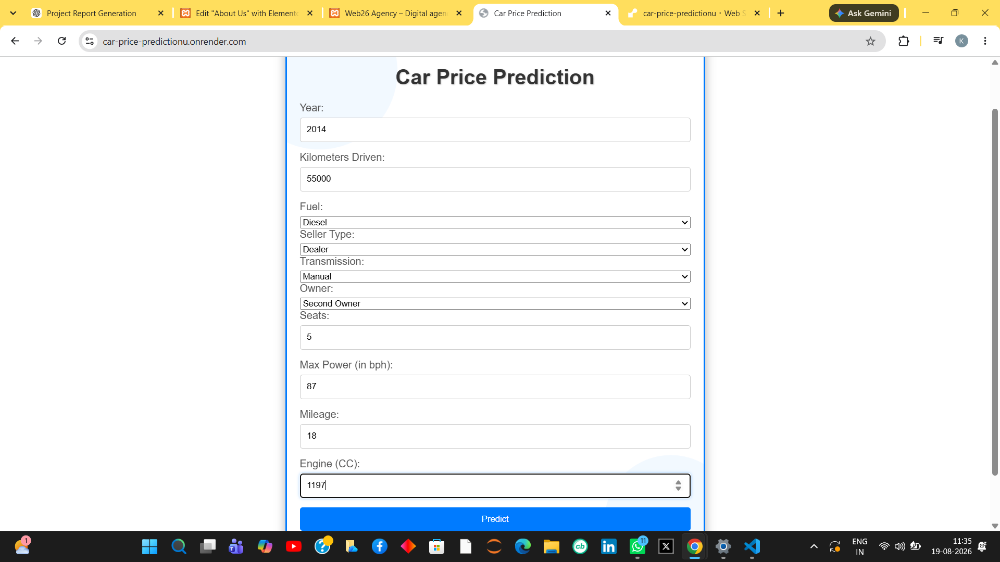
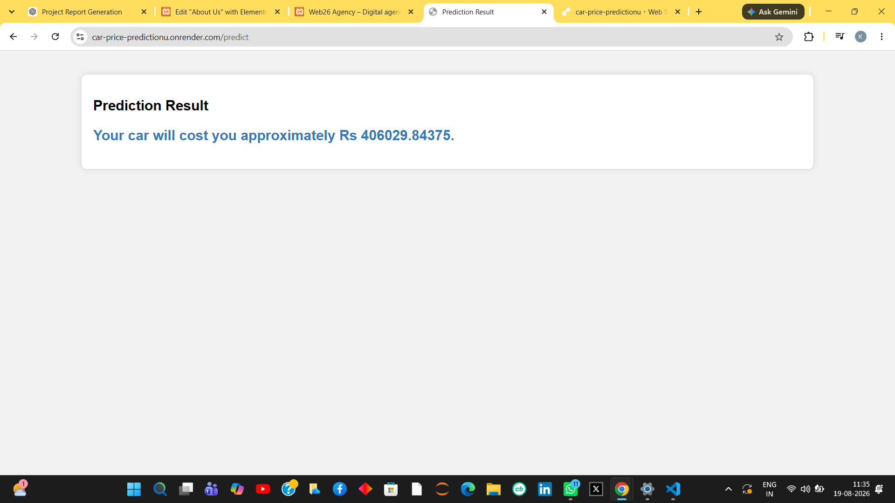

# 🚗 Car Price Prediction

A Machine Learning web application that predicts the price of a car based on user-provided details.

## 🌐 Live Demo

[Try the Live Application](https://car-price-predictionu.onrender.com)

## 📌 Project Overview

This project uses Machine Learning to estimate the price of a car based on various features such as car specifications and other relevant attributes.

The trained model is integrated into a Flask web application, allowing users to enter the required information through a web interface and receive an estimated car price.

## 📸 Screenshots

### Home Page


### Prediction Result


## 🛠️ Technologies Used

- Python
- Flask
- Scikit-learn
- Pandas
- NumPy
- HTML
- CSS
- Gunicorn
- Render

## 🤖 Machine Learning

The project includes:

- Data preprocessing
- Feature processing
- Model training
- Model serialization using Pickle
- Prediction through Flask
- Web-based user interface

The trained model is stored in:

`model_car.pkl`

## 📂 Project Structure

```text
car-price-prediction/
│
├── app.py
├── train_model.py
├── car_price.csv
├── model_car.pkl
├── requirements.txt
├── Procfile
├── style.css
│
└── templates/
    ├── index.html
    └── prediction.html
